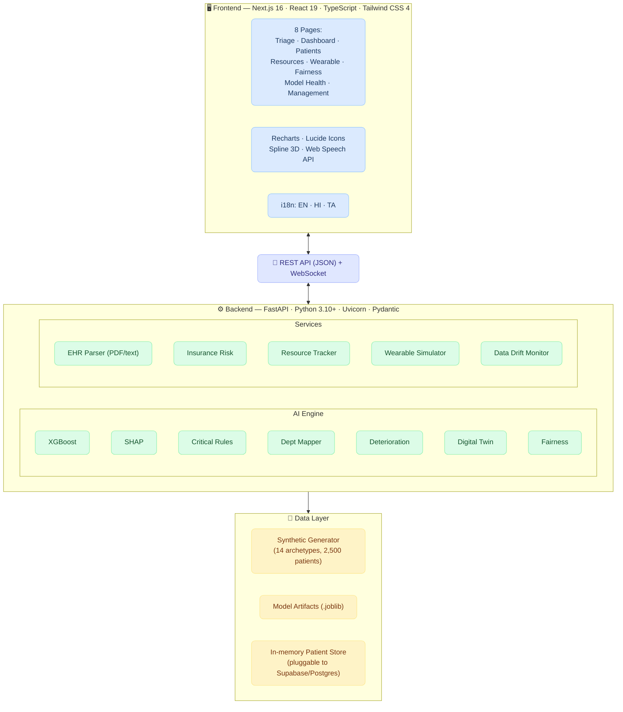
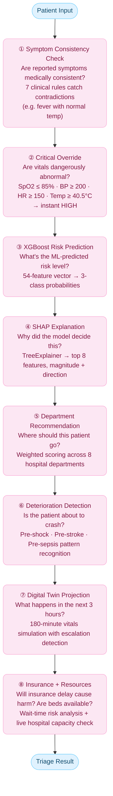

<p align="center">
  
  
  
  
  
  
</p>

<h1 align="center">VIGIL</h1>
<h3 align="center">Vital Intelligence for Guided Intervention & Logistics</h3>
<h4 align="center">AI-Powered Smart Triage System</h4>

<p align="center">
  <em>An intelligent healthcare triage platform that combines machine learning, explainable AI, and real-time monitoring to help emergency departments make faster, fairer, and more transparent patient prioritization decisions.</em>
</p>

---

## What is VIGIL?

Imagine walking into a busy emergency room. Dozens of patients, each with different symptoms, histories, and urgency levels. How do you decide who gets seen first?

**VIGIL** answers that question with AI. It's a full-stack healthcare triage system that takes a patient's vitals, symptoms, and medical history and, within milliseconds, returns:

- A **risk classification** (High / Medium / Low) powered by a trained XGBoost model
- A **plain-English explanation** of *why*, using SHAP explainability
- A **department recommendation** for where to route the patient
- **Early warning alerts** if the patient shows signs of shock, stroke, or sepsis
- A **digital twin simulation** projecting how their vitals will evolve over the next 3 hours
- An **insurance risk assessment** checking if pre-authorization delays could endanger the patient
- **Real-time hospital resource status** across multiple facilities

Everything is wrapped in a dark-themed glassmorphism UI that supports 4 languages and works on any device.

---

## Features at a Glance

| Feature | What It Does |
|---|---|
| AI Risk Classification | XGBoost classifier with 99.8% accuracy across High/Medium/Low risk levels |
| SHAP Explainability | Shows the top 8 factors driving each prediction with visual impact bars |
| Critical Override | Hard-coded safety net — if vitals hit dangerous thresholds, the system immediately flags High risk regardless of ML output |
| Smart Department Routing | Weighted scoring across 8 departments (Emergency, Cardiology, Neurology, and more) |
| Deterioration Detection | Detects pre-shock, pre-stroke, and pre-sepsis patterns with urgency scores |
| Digital Twin | Interactive Spline 3D anatomical model embedded in the triage page, indicating escalation and patient state |
| Digital Twin Simulation | Projects patient vitals over 180 minutes to predict deterioration windows |
| Insurance Risk Analysis | Cross-references insurer response times with digital twin to flag dangerous delays |
| Live Dashboard | Real-time charts for risk distribution, department load, triage activity, and model metrics |
| Wearable Monitoring | WebSocket-powered live vitals stream simulating smartwatch data |
| Bias & Fairness Audit | Demographic parity, disparate impact ratio, and equalized odds analysis |
| Model Health / Data Drift | KS-test per feature, PSI label drift, radar visualization, one-click retrain trigger |
| EHR/EMR Upload | Upload PDF or text clinical documents — auto-extracts patient data via NLP |
| Voice Input | Speak symptoms directly using the Web Speech API |
| 3-Language Support | Full i18n: English, Hindi (हिन्दी), Tamil (தமிழ்) |
| Hospital Management | CRUD for hospitals, doctors, and patient-doctor assignments with capacity tracking |
| Export & Print | Download triage results as JSON or print-ready reports |

---

## Architecture Overview

VIGIL follows a clean three-layer architecture:



---

## The 8-Step Triage Pipeline

Every time a patient is submitted, VIGIL runs an **8-step AI pipeline** in under 200ms:



---

## Tech Stack

### Backend

| Technology | Purpose |
|---|---|
| Python 3.10+ | Core language |
| FastAPI | High-performance async REST API framework |
| XGBoost | Gradient-boosted decision tree classifier (250 trees, depth 6) |
| SHAP | TreeExplainer for model interpretability |
| scikit-learn | Feature engineering, label encoding, train/test split |
| pandas / numpy | Data manipulation and numerical computing |
| pdfplumber | PDF text extraction for EHR documents |
| scipy | KS-test for data drift detection |
| Faker | Synthetic patient data generation |
| Uvicorn | ASGI server with hot-reload |

### Frontend

| Technology | Purpose |
|---|---|
| Next.js 16 | React-based framework with App Router |
| React 19 | UI component library |
| TypeScript | Type-safe frontend development |
| Tailwind CSS 4 | Utility-first styling with glassmorphism dark theme |
| Recharts | Charts — bar, pie, area, line, radar |
| Lucide Icons | Icon library |
| Spline Viewer | 3D interactive anatomical body model |
| Web Speech API | Browser-native voice symptom input |

---

## Getting Started

### Prerequisites

- **Python 3.10+** and **pip**
- **Node.js 18+** and **npm**
- A terminal (macOS/Linux/WSL recommended)

### 1. Clone the Repository

```bash
git clone https://github.com/your-username/vigil.git
cd vigil
```

### 2. Set Up the Backend

```bash
# Create a virtual environment
python -m venv venv
source venv/bin/activate        # On Windows: venv\Scripts\activate

# Install Python dependencies
pip install -r requirements.txt

# Train the ML model (generates model artifacts)
python -m backend.ai_engine.train_model

# Start the backend server
uvicorn backend.main:app --reload --port 8000
```

The backend API will be live at `http://localhost:8000`. Check the health endpoint:

```bash
curl http://localhost:8000/health
```

### 3. Set Up the Frontend

Open a new terminal:

```bash
cd frontend

# Install Node dependencies
npm install

# Start the dev server
npx next dev --port 3000
```

Open your browser at **http://localhost:3000** — you should see the VIGIL dashboard.

### 4. Try It Out

1. Click **"New Triage"** in the sidebar
2. Fill in patient details (or use voice input 🎤)
3. Select symptoms and pre-existing conditions
4. Hit **Submit** and watch the 8-step pipeline generate results
5. Explore the SHAP chart, digital twin timeline, deterioration alerts, and more

---

## Project Structure

```
vigil/
├── README.md
├── ARCHITECTURE_DIAGRAM_PROMPT.md     ← AI image gen prompt for architecture diagram
├── FLOW_DIAGRAM_PROMPT.md             ← AI image gen prompt for flow diagram
├── requirements.txt                   ← Python dependencies
│
├── backend/
│   ├── main.py                        ← FastAPI app, CORS, WebSocket, lifespan
│   ├── api/
│   │   ├── routes.py                  ← 25+ REST endpoints (triage, CRUD, drift, etc.)
│   │   └── schemas.py                 ← Pydantic request/response models
│   ├── ai_engine/
│   │   ├── predictor.py               ← XGBoost inference + SHAP explanation
│   │   ├── department_mapper.py       ← Weighted department recommendation
│   │   ├── deterioration_detector.py  ← Pre-shock / pre-stroke / pre-sepsis detection
│   │   ├── digital_twin.py            ← 180-minute vitals trajectory simulation
│   │   ├── symptom_checker.py         ← 7 clinical consistency rules
│   │   ├── fairness_analyzer.py       ← Demographic parity, disparate impact, equalized odds
│   │   └── train_model.py             ← Training pipeline (synthetic data → XGBoost model)
│   ├── data/
│   │   ├── synthetic_generator.py     ← 14-archetype patient generator (2,500 patients)
│   │   └── synthetic_patients.csv     ← Generated training dataset
│   ├── models/
│   │   ├── triage_model.joblib        ← Trained XGBoost model
│   │   ├── feature_columns.joblib     ← 54 ordered feature names
│   │   ├── label_encoder.joblib       ← High/Medium/Low encoder
│   │   └── training_metrics.json      ← Accuracy, per-class metrics, confusion matrix
│   └── services/
│       ├── ehr_parser.py              ← PDF/text clinical document extraction
│       ├── insurance_risk.py          ← Insurer profiles + wait-time risk assessment
│       ├── resource_tracker.py        ← 3-hospital resource management
│       └── wearable_sim.py            ← WebSocket vitals stream simulator
│
└── frontend/
    ├── package.json
    ├── next.config.ts
    └── src/
        ├── lib/
        │   ├── api.ts                 ← Typed API client with all interfaces
        │   └── i18n.tsx               ← 4-language i18n (EN / ES / HI / TA)
        └── app/
            ├── layout.tsx             ← Root layout + Sidebar + dark theme
            ├── globals.css            ← Glassmorphism dark theme (custom CSS)
            ├── page.tsx               ← Dashboard (charts, stats, metrics)
            ├── triage/page.tsx        ← Triage form + results + 3D viewer
            ├── patients/page.tsx      ← Patient records (search, filter, expand)
            ├── resources/page.tsx     ← Hospital resources (beds, equipment, staff)
            ├── wearable/page.tsx      ← Wearable device monitor config
            ├── fairness/page.tsx      ← Bias & fairness analysis dashboard
            ├── drift/page.tsx         ← Model health & data drift detection
            ├── manage/page.tsx        ← Hospital, doctor, assignment management
            └── components/
                ├── Sidebar.tsx        ← Navigation sidebar
                ├── ShapChart.tsx      ← SHAP explanation bar chart
                ├── DigitalTwinChart.tsx ← Vitals timeline projection chart
                ├── RiskBadge.tsx      ← Risk level badge (High/Medium/Low)
                ├── WearableMonitor.tsx ← Live WebSocket vitals chart
                └── Providers.tsx      ← i18n context provider
```

---

## The ML Model

### Training Data

VIGIL's model is trained on **2,500 synthetic patients** generated from **14 clinical archetypes**:

| Archetype | Risk Level | Example |
|---|---|---|
| Elderly Cardiac Emergency | High | 68yo male, chest pain, BP 195/110, SpO2 88% |
| Acute Stroke Presentation | High | 72yo, slurred speech, severe hypertension |
| Severe Sepsis | High | Fever 103°F, tachycardia, hypotension |
| Respiratory Distress | High | COPD exacerbation, SpO2 85% |
| Moderate Fever + Pain | Medium | 45yo, abdominal pain, mild fever |
| Hypertensive Episode | Medium | BP 160/100, headache |
| Common Cold | Low | Runny nose, sneezing, normal vitals |
| Routine Checkup | Low | Healthy vitals, minor complaint |
| *...and 6 more archetypes* | Mixed | Covering diverse clinical scenarios |

### Feature Engineering (54 Features)

- **7 numeric vitals**: age, bp_systolic, bp_diastolic, heart_rate, temperature, spo2, insurance_response_hours
- **1 gender encoding**: binary
- **30 symptom flags**: `sym_chest_pain`, `sym_shortness_of_breath`, `sym_headache`, etc.
- **11 condition flags**: `cond_hypertension`, `cond_diabetes`, `cond_asthma`, etc.
- **3 derived features**: pulse pressure, mean arterial pressure (MAP), shock index (HR/SBP)
- **2 count features**: number of symptoms, number of conditions

### Model Performance

| Metric | Score |
|---|---|
| Overall Accuracy | 96.4% |
| High Risk | Precision: 1.000 · Recall: 1.000 · F1: 1.000 |
| Medium Risk | Precision: 0.994 · Recall: 1.000 · F1: 0.997 |
| Low Risk | Precision: 1.000 · Recall: 0.995 · F1: 0.997 |

> **Note**: This is a demo system using synthetic data. Real-world deployment would require clinical validation, regulatory approval, and real patient data.

---

## API Reference

The backend exposes **25+ REST endpoints** and **1 WebSocket endpoint**.

### Core Triage

| Method | Endpoint | Description |
|---|---|---|
| POST | `/api/triage` | Run the full 8-step triage pipeline |
| POST | `/api/upload-ehr` | Upload and parse EHR documents |
| GET | `/api/meta/symptoms` | Get all valid symptom and condition codes |

### Dashboard & Patients

| Method | Endpoint | Description |
|---|---|---|
| GET | `/api/dashboard/stats` | Aggregated dashboard statistics |
| GET | `/api/dashboard/patients` | List all triaged patients |
| GET | `/api/dashboard/patient/{id}` | Full triage result for a patient |

### Model & Fairness

| Method | Endpoint | Description |
|---|---|---|
| GET | `/api/model/metrics` | Training accuracy, per-class metrics, confusion matrix |
| GET | `/api/model/fairness` | Bias & fairness analysis results |
| GET | `/api/model-health` | Data drift detection (KS-test, PSI) |
| POST | `/api/model-health/retrain` | Trigger model retraining |

### Hospital Resources

| Method | Endpoint | Description |
|---|---|---|
| GET | `/api/resources` | All hospital resources status |
| GET | `/api/resources/check/{dept}` | Capacity check for a department |
| POST | `/api/resources/admit` | Admit patient (decrement beds) |
| POST | `/api/resources/discharge` | Discharge patient (increment beds) |

### Hospital / Doctor / Assignment Management

| Method | Endpoint | Description |
|---|---|---|
| POST | `/api/hospitals` | Create a hospital |
| GET | `/api/hospitals` | List all hospitals |
| DELETE | `/api/hospitals/{id}` | Delete a hospital |
| POST | `/api/doctors` | Register a doctor |
| GET | `/api/doctors` | List all doctors |
| DELETE | `/api/doctors/{id}` | Delete a doctor |
| POST | `/api/assignments` | Assign patient to doctor |
| GET | `/api/assignments` | List all assignments |
| DELETE | `/api/assignments/{id}` | Delete an assignment |

### WebSocket

| Endpoint | Description |
|---|---|
| `ws://localhost:8000/ws/vitals/{patient_id}` | Real-time vitals stream (HR, SpO2, steps, alerts) every 2 seconds |

---

## UI Design

VIGIL uses a **spatial glassmorphism** dark theme inspired by futuristic medical interfaces:

- Deep dark background (`#070b14`) with mesh gradient orbs (purple, blue, cyan)
- Frosted glass panels — `rgba(255,255,255,0.04)` with `backdrop-filter: blur(16px)`
- Neon cyan accents (`#00f2ff`) for highlights, borders, and interactive elements
- Neumorphic glow effects on hover states
- Dark data tables with subtle row highlighting
- Color-coded risk levels: 🔴 High · 🟡 Medium · 🟢 Low

---

## Internationalization

Every UI string in VIGIL is translatable. Currently supported:

| Language | Code | Coverage |
|---|---|---|
| 🇬🇧 English | `en` | 120+ keys |
| 🇮🇳 हिन्दी (Hindi) | `hi` | 120+ keys |
| 🇮🇳 தமிழ் (Tamil) | `ta` | 120+ keys |

Switch languages instantly from the sidebar — the entire UI updates in real time with no page reload.

---

## Built With Determination

Built as a hackathon project to showcase how AI can assist (not replace) healthcare professionals in making faster, more transparent, and fairer triage decisions.

---

<p align="center">
  <strong>VIGIL</strong> — Because every second counts in healthcare.
</p>
